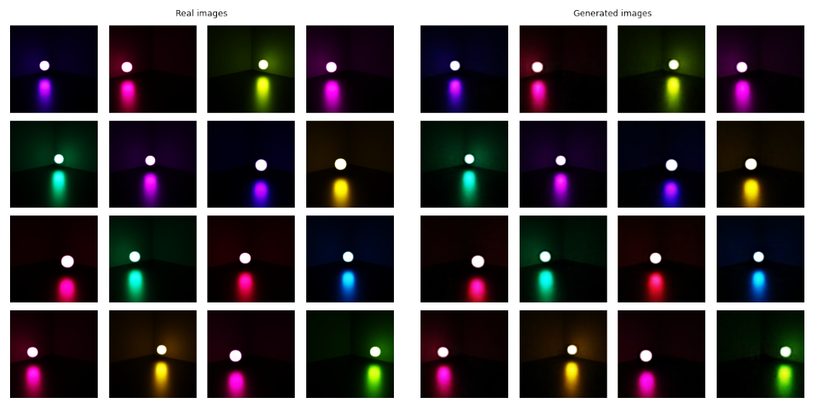

# BlenderCNN

Investigate the potential use of Blender for data generation

## Project description

Flying dots, transpose CNN

## Blender

Offsets + images

## Deep Learning model

## Results

## Sources

- https://docs.blender.org/api/current/index.html

